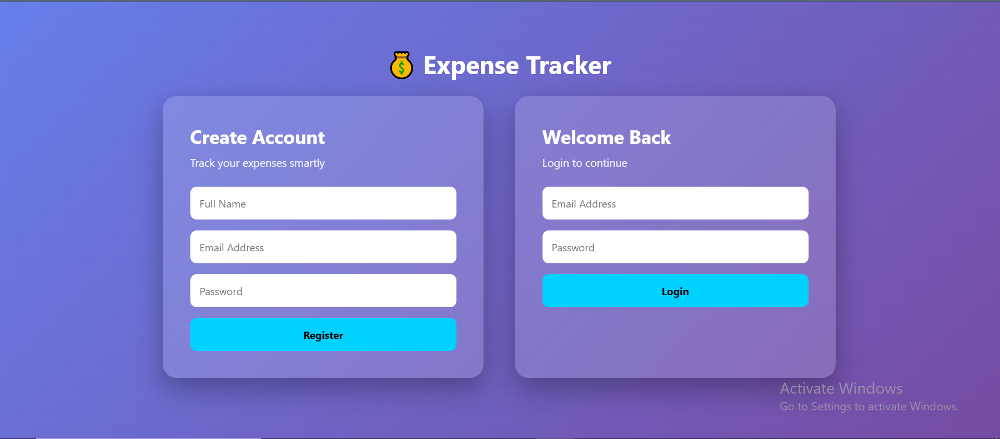
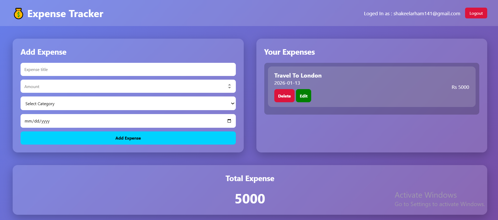

# 💰 Expense Tracker App

A modern expense tracker web application built using **HTML, CSS, JavaScript & Firebase**.  
Users can add, view and manage their daily expenses securely.

---

## 🚀 Features
- User Authentication (Login / Register)
- Add Expenses
- Delete Expenses
- Real-time Expense List
- Total Expense Calculation
- Firebase Firestore Integration
- Responsive UI

---

## 🛠️ Tech Stack
- HTML
- CSS
- JavaScript
- Firebase Authentication
- Firebase Firestore

---

## 📸 Screenshots

### 🔐 Login

### 📊 Dashboard

---

## 🔗 Live Demo
**[View Live Expense Tracker](https://expence-tracker12.netlify.app/)**

---

## 📂 How to Run
1. Clone the repository
2. Open `index.html` in browser
3. Configure Firebase keys
4. Start tracking expenses 🚀

---

## 👤 Author
**Arham Ahmed Ansari**
